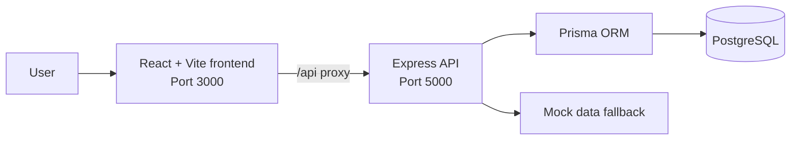

# Architecture

## Overview

NEXUS ERP AI is a TypeScript monorepo with a React single-page application and an Express API. The frontend is served by Vite during development and sends `/api` calls to the backend through a development proxy. The API uses Prisma to access PostgreSQL and gracefully returns seeded mock data for selected read operations when a database is unavailable.



## Components

### Frontend

- React 18 and TypeScript provide the application UI.
- Vite handles local development and production bundling.
- Tailwind CSS supplies the visual system; Framer Motion supports motion effects.
- React Query manages server-state requests, while React Hook Form and Zod support forms and validation.
- The UI provides Dashboard, Customers, Inventory, Sales Challans, Reports, command palette, authentication context, theme context, and toast notifications.

### Backend

- Express exposes JSON REST endpoints.
- `dotenv` loads local environment configuration.
- JWT support is present for role-aware requests; requests without an authorization header use the default demo user.
- Prisma is the database access layer for PostgreSQL.
- API handlers use seed data as a usable fallback where database calls fail.

### Data layer

The PostgreSQL schema models users, customers, products, stock movements, sales challans, challan line items, customer follow-ups, and audit logs. See [ERD.md](ERD.md) for the relationships.

## Request flow

1. The browser loads the Vite application on port `3000`.
2. The frontend calls a relative `/api/...` URL.
3. Vite proxies that request to the Express server on port `5000` during development.
4. Express validates or assigns a demo user, then queries PostgreSQL through Prisma.
5. The API returns database records or the appropriate mock fallback.

## Repository layout

```text
NEXUS/
├── frontend/          React + Vite application
│   └── src/           views, components, contexts, API client
├── backend/           Express API and Prisma configuration
│   ├── server/        API entry point
│   ├── prisma/        database schema and seed script
│   └── src/services/  mock data
├── scripts/           build support scripts
└── docs/              project documentation
```
