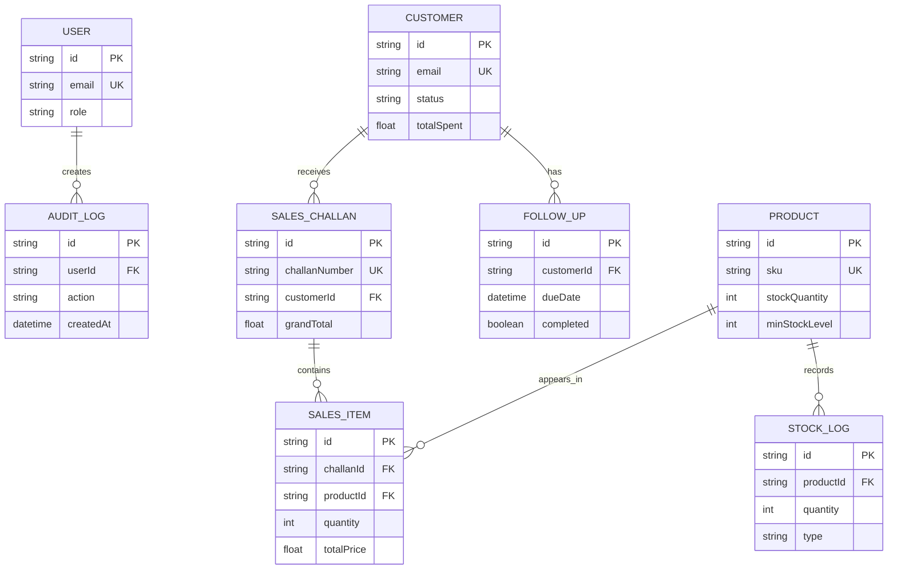

# Data Model and ERD

The following diagram reflects `backend/prisma/schema.prisma`.

## Relationship notes

- A customer can have many sales challans and follow-ups.
- A sales challan has one or more sales items.
- A product can appear in many sales items and stock logs.
- Deleting a product cascades to its stock logs; deleting a sales challan cascades to its sales items.
- An audit log belongs to the user whose action it records.
